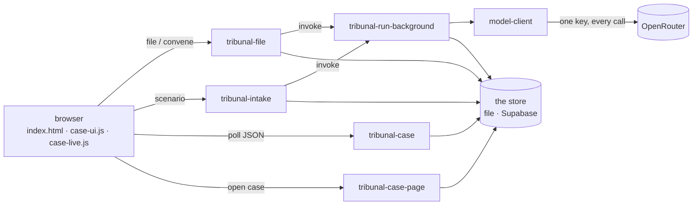
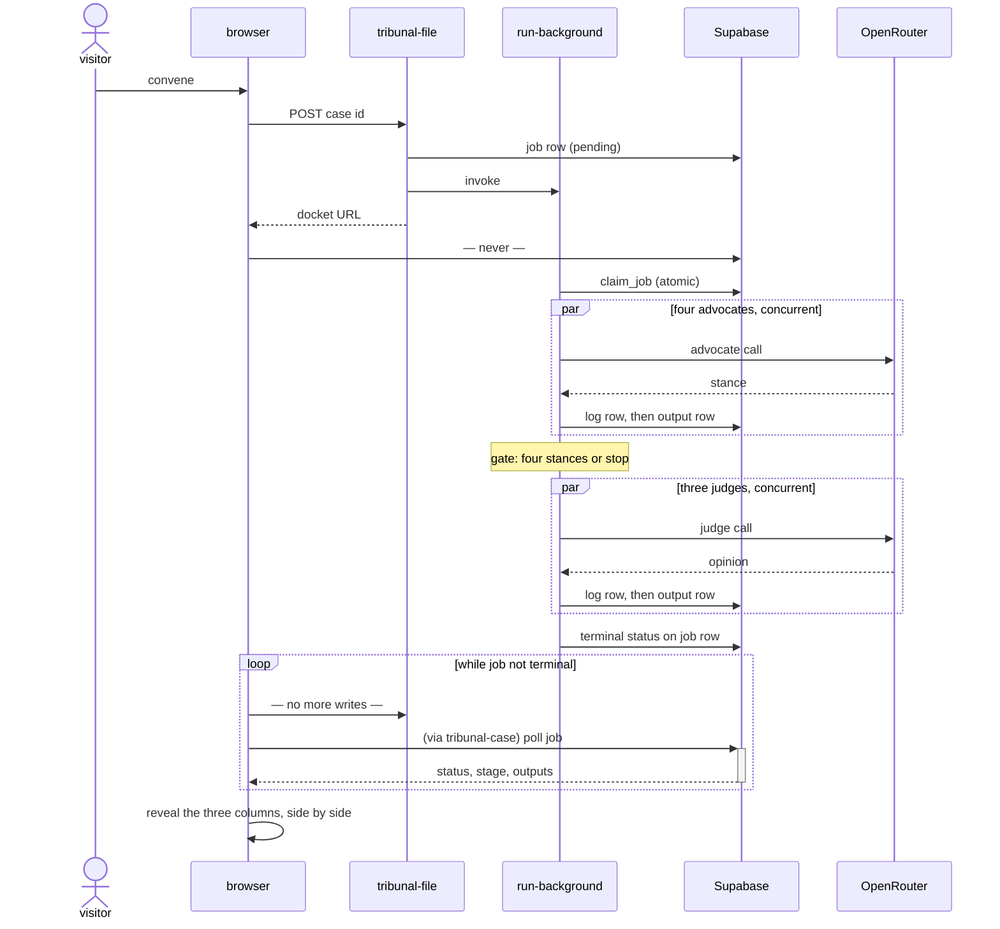

# The Tribunal, architecture

How the infrastructure is built, for a reader with the code in front of them who has never seen
it. Every claim here names the file that proves it. The rules the system obeys, and the stage-by-
stage mechanics of a deliberation, are spec.md's subject; this document says only where each part
runs and how the parts reach each other.

## The pieces

- **The browser pages.** The home page is a static file, `public/index.html`, its behaviour an
  inline script in that same file: choose a case or submit a scenario, choose a panel, convene. A
  case page is not static: it is server-rendered, and the browser receives finished HTML. While a
  deliberation is in flight, `public/case-live.js`, injected by the page function, polls and
  reveals the server-rendered cards; `public/case-ui.js` adds the reason stepper on every case
  page. Neither renders content of its own.
- **Five Netlify functions**, in `netlify/functions/`:
  - `tribunal-file.mts` — filing and convening. Validates a charge sheet against the rules
    (`src/protocol/validate-charge-sheet.ts`), naming the failed rule; stamps what only the system
    may write (`src/protocol/stamp.ts`); writes the job row; invokes the background function. No
    model call happens here.
  - `tribunal-intake.mts` — scenario submission, retired 2026-09-05 (`spec.md` part two, step 0).
    Answers 503 naming the retirement. The clerk it once fed (`src/protocol/intake.ts`) and the
    background function's intake branch remain, reachable by nothing on the live site.
  - `tribunal-run-background.mts` — the background function, where every model call in the system
    happens: the intake clerk's draft (`src/protocol/intake.ts`) and the seven-role protocol
    (`src/protocol/run.ts`).
  - `tribunal-case.mts` — the read-only JSON endpoint the page polls, and the docket listing
    (`?list=1`). The one door to the data from outside.
  - `tribunal-case-page.mts` — serves the case page, rendered by the same renderer the static
    render uses (`src/page/render-case.ts`), with per-seat usage computed from the log rows
    (`src/page/usage.ts`).
- **One store, chosen by `TRIBUNAL_STORE`** in `src/store/index.ts`: the file store
  (`src/store/file-store.ts`), a directory per deliberation, or the Supabase store
  (`src/store/supabase-store.ts`) over the four tables of the committed migration
  `supabase/migrations/0001_tribunal.sql`. The deployed site has run on the file store since
  2026-09-18 (see **Deploy**). Everything that is per case or across deliberations — the charge
  sheets, the docket, the count the daily cap is measured against — is the same choice again in
  `src/store/catalogue.ts`; until that file existed the handlers made those as PostgREST calls
  written inline, which is why the site could not run without Supabase whatever the store was.
- **OpenRouter** is the single model gateway; one key, every call.
- **One client module**, `src/client/model-client.ts` with its HTTP layer
  `src/client/openrouter-transport.ts`: the only code that holds the key, the caps, the
  temperature, the transport retry policy, and the log-row format. Everything else asks it.

Arrows point the way requests move; the browser never touches the store or OpenRouter, and no
function calls a model except through the client module.

## The request paths

- **Filing a charge sheet.** POST to `tribunal-file.mts`. Rules checked, failures named, sheet
  stamped and stored, job row written `pending`, background function invoked, docket URL returned.
- **Submitting a scenario.** POST to `tribunal-intake.mts` answers 503: retired 2026-09-05. Until
  then it checked the word bounds, reserved the docket row and job, and handed the scenario to the
  background function, where the clerk drafted.
- **Convening.** POST to `tribunal-file.mts` with a case id: a fresh job row for an existing
  stamped sheet, then the same background invocation. The paid-panel daily cap is enforced here.
- **Polling a run in progress.** `public/case-live.js`, injected by `tribunal-case-page.mts`,
  polls the job and re-fetches the server-rendered HTML when it advances, revealing the cards
  that now exist. The browser holds no protocol state the server does not.
- **Opening a past case.** GET `/case/<deliberation_id>`, redirected by `netlify.toml` to
  `tribunal-case-page.mts`, which renders stored objects. The committed runs under `runs/` are the
  same renderer run offline by `scripts/render-static.ts`, with no key in the environment.

## The database

The deployed site has had no database since 2026-09-18: it runs on the file store, and
`supabase/migrations/0001_tribunal.sql` stays in the repository as the schema the Supabase store
expects, still selectable with `TRIBUNAL_STORE=supabase` and still exercised by
`tests/supabase-store.test.ts` and the both-implementations drills in `tests/store-drills.test.ts`.
What the file store keeps instead is `<TRIBUNAL_RUNS_DIR>/<deliberation_id>/` — `job.json`,
`outputs/<role>.json`, `log.jsonl`, the same objects as the rows below — with the charge sheets
beside them under `cases/` (`src/store/catalogue.ts`). Its claim is read-then-write, documented in
`src/store/file-store.ts` as the approximation of the atomic rule that the SQL function makes true.

Four tables, all in `supabase/migrations/0001_tribunal.sql`:

- `charge_sheets` — sheets as stored after stamping, one row per case id.
- `jobs` — one row per deliberation: status, stage, terminal reason, accumulated calls and spend,
  attempts per role, claim and heartbeat timestamps, completed and failed roles, and the resolved
  role-to-model map as used.
- `outputs` — one row per role per deliberation, stance, opinion, or failure record, written as
  each lands.
- `call_log` — one row per model attempt; the cost of a deliberation equals the sum of its rows.

Row-level security is enabled on all four tables with no policies written (the `alter table ...
enable row level security` lines at the end of the migration), so PostgREST serves nothing to the
anonymous role and only the service-role key, held server-side, reads or writes. The claim and
heartbeat are SQL functions in the same migration, `claim_job` and `heartbeat_job`, so their
atomicity is the database's, not the caller's.

## The background function, and why it exists

A deliberation is minutes of model calls; a synchronous Netlify function answers in seconds. The
background function (`tribunal-run-background.mts`) has a 15-minute ceiling, and the platform
automatically re-invokes an invocation it believes failed, after one minute and again after two.
That platform behaviour shapes the function:

- **The atomic claim.** The function claims the job through `claim_job` before any work; one row
  updated or zero. A concurrent re-invocation loses the claim and exits without a single call.
- **The heartbeat.** The function refreshes `heartbeat_at` as it works. A job left `running` by a
  function that died becomes claimable again once the heartbeat passes the stale threshold; a
  terminal job is never claimable at all.
- **Budget on the job row.** Calls and spend accumulate on the job row, never in process memory,
  so a re-invocation inherits the money already spent; a fresh invocation never gets a fresh
  budget (`src/client/model-client.ts` reads and writes them through the store).
- **Resume from stored outputs.** On re-entry, a role with a stored output is not called again and
  a stage whose outputs all exist is not re-run (`src/protocol/run.ts`).

## The key

`OPENROUTER_API_KEY` lives in the Netlify server environment and nowhere else. It is read inside
the functions (`src/functions-env.ts` checks its presence and fails loudly) and handed to the
transport. It never reaches: the browser (there is no client bundle to hold it), an HTTP response,
a log row (`src/client/model-client.ts` defines the row and no field carries it), or a committed
file (`.githooks/pre-commit` refuses key patterns before any commit). The hard credit limit on the
key itself, set at the provider, is the one control that survives all of this being wrong.

## Deploy

Three hosts have run the same handlers; none of them changed one.

**The owner's host, since 2026-09-18.** `tribunal.atomworks.dev` is one container: `Dockerfile` at
the repository root, `FROM node:24.11.1-slim`, the repository copied in, run as the unprivileged
`node` user, `CMD ["node", "server/serve.ts"]` — no build and no install step, because the pinned
Node strips TypeScript natively and `package.json` declares no dependency. Its health check is
Node's own `fetch` against `/`, the base image carrying neither wget nor curl. The compose file
`deploy/docker-compose.yml` publishes no port: the service joins the external Docker network `atomworks`, where
the Caddy already running on that host reaches it as `tribunal:8888`. `.dockerignore` says what
stays out of the image; `runs/` and `fixtures/` stay in, because the committed deliberations and
the committed charge sheets are what the site renders and what seeds its docket.

The store is the file store on the named volume `tribunal_runs`, mounted at the `TRIBUNAL_RUNS_DIR`
the compose file sets. `TRIBUNAL_PERSISTENT_HOST=1`, also set there, is the whole of what makes
that legitimate: `src/functions-env.ts` accepts `TRIBUNAL_STORE=file` only with that flag, and
without it a deployed handler refuses the file store in the same words as before, because a
function platform's filesystem vanishes with the invocation. The flag excuses nothing else — a
missing `TRIBUNAL_FUNCTION_SECRET` or `OPENROUTER_API_KEY` is still named and still stops the
handler before any model call (`tests/functions-env.test.ts`). The repository's own `runs/` ships
inside the image and the volume is somewhere else, so `src/store/index.ts` reads a committed id
from the image and every other id from the volume; nothing is copied on start, and a committed run
cannot be written over. A deliberation id reaches a handler from a query string and the file store
turns it into a path, so the same file refuses an id that is not one path segment. All of this is
held by `tests/store-select.test.ts`, which drives the case endpoint and the case page through the
file store with the network blocked. Supabase is not reachable from this host and is not needed by
it: `.env` there holds `OPENROUTER_API_KEY`, `TRIBUNAL_FUNCTION_SECRET` and
`TRIBUNAL_FILING_ENABLED` and nothing else. The cases deliberated on the earlier hosts were not
migrated, by decision.

The difference Render introduced stands here too, for the same reason: nothing re-invokes a
background function that dies, so a deliberation killed mid-run stays `running` until its heartbeat
goes stale and the case page reports the stall. A failure shown as a failure, not a substitution.

**Render, 2026-09-05 to 2026-09-18.** `server/serve.ts` is a plain Node server that hosts the five handlers
on the paths Netlify gave them, and `render.yaml` describes the free web service that runs it with
`npm start`. The server mirrors `netlify.toml` claim by claim: `public/` as static files with byte
ranges for the gavel clip, `/.netlify/functions/<name>` for the five names and no other, `/case/<id>`
onto the page handler with the id as the redirect passed it, and the background function answered
202 before it runs. `tests/server.test.ts` holds each of those claims on loopback with no store
environment, so every handler answers before it could reach Supabase. One difference stands: on
Netlify the platform re-invokes a background function that dies, and the claim-and-heartbeat
mechanism of spec.md part three resumes the job; on Render nothing re-invokes, so a deliberation
killed mid-run stays `running` until its heartbeat goes stale, and the case page reports the stall
after four minutes of no advance. That is a failure shown as a failure, not a substitution. The free
instance slept after fifteen idle minutes and woke in under a minute; a live page polls every five
seconds, so a run in progress kept it awake. `render.yaml` stays as the record of that host.

**Netlify, until 2026-09-05.** `netlify.toml` publishes `public/` and serves `netlify/functions/`;
the `/case/*` redirect maps case URLs onto the page function. Deploys stopped when the account's
credit ran out; the CLI's refusal is recorded in the maintenance-8 pack. The configuration stays
so the site deploys there again the day credit returns, unchanged.

The Node version is pinned four times, in `.nvmrc`, `netlify.toml`, `render.yaml`, and the
`Dockerfile`'s base image, so local and any deploy cannot disagree; the pinned version strips TypeScript natively, so there is no
build step and no dependency — `package.json` declares none.

`SECRETS_SCAN_OMIT_KEYS` in `netlify.toml` omits `TRIBUNAL_STORE` and `TRIBUNAL_FILING_ENABLED`
from Netlify's secret scanning. Both are non-secret flags whose values are ordinary words that
legitimately appear in deployed output, which the scanner cannot know; the omission is named in
the committed file so a reader can check exactly what is exempt, and the API key is not exempt.

## Configuration

- `config/caps.json` — every numeric cap: calls, spend, attempts, timeout, temperature, output
  ceiling, backoff. Read by `netlify/functions/tribunal-run-background.mts` and
  `src/protocol/run.ts`, and handed to the client module at construction
  (`src/client/model-client.ts`). No code path raises the call or spend caps mid-run; the output
  ceiling alone is raised mid-run, doubling on each truncation retry, the truncation remedy of
  spec.md criterion 6.
- `config/models.json` — the named panels, the intake model, and the per-role fallback lists, with
  the decisions that shaped them recorded in its comment. Read by the background function and the
  scripts.
- `config/roles.json` — the seat of each advocate and the label of each judge. Read by
  `src/protocol/run.ts`; no real jurist's name appears in any id.
- `config/forbidden-vocabulary.json` — the aggregation vocabulary the project must never use.
  Read by `.githooks/pre-commit`, which refuses a commit containing it, and by the tests that
  assert the rule.

## What was rejected

Three execution shapes were considered and rejected — the protocol in the browser, a single
streaming function, and a stage-advancing worker. spec.md part three states each and the reason;
this document does not restate them.
